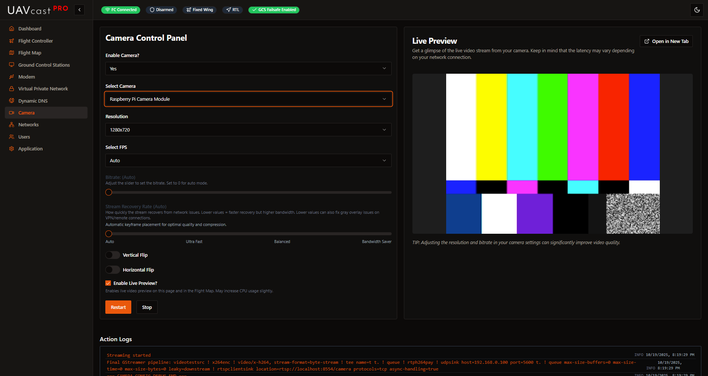

# Camera



The Camera page allows you to configure video streaming from your Raspberry Pi camera or USB cameras to your ground control station. UAVcast-Pro v6 features an integrated HLS-based live preview directly in the web interface.

## Overview

UAVcast-Pro v6 uses a dual-stream architecture for video:

**GStreamer** - Primary video streaming:
- H.264 video encoding
- UDP streaming to ground control stations
- Low latency for flight operations
- Support for Raspberry Pi Camera and USB cameras
- Custom pipeline support
- Configurable resolution, FPS, and bitrate

**MediaMTX** - Internal preview only:
- HLS stream for web browser preview
- Live camera preview in UAVcast-Pro interface
- Uses the same GStreamer source
- Approximately 2-3 seconds latency (normal for HLS)


### Raspberry Pi Camera
- **Pi Camera Module v1/v2**: Uses `libcamera` or `rpicam`
- **Pi Camera Module 3**: Full support with libcamera
- **HQ Camera**: Supported


### USB Cameras
Auto-detected USB cameras appear in the dropdown:
- Logitech C615
- Logitech C920
- Most V4L2-compatible USB cameras

Check available cameras: `v4l2-ctl --list-devices`

## Video Configuration

### Resolution

Available resolutions:
- **320x240** (QVGA) - Low bandwidth
- **640x480** (VGA) - Standard definition
- **1280x720** (HD/720p) - High definition
- **1920x1080** (Full HD/1080p) - Maximum quality

:::tip Bandwidth Considerations
Higher resolution requires more bandwidth:
- 320x240: ~300-500 Kbps
- 640x480: ~800-1200 Kbps
- 1280x720: ~1500-3000 Kbps
- 1920x1080: ~3000-6000 Kbps

Choose based on your available network bandwidth (4G/WiFi/Ethernet).
:::

### Frame Rate (FPS)

- **Range:** 5-30 FPS
- **Recommended:** 15-20 FPS for most applications
- **Low bandwidth:** 10-15 FPS
- **High quality:** 25-30 FPS

### Bitrate

- **Range:** 500-8000 Kbps
- **Recommended:** 1500-3000 Kbps
- **Low bandwidth:** 800-1500 Kbps
- **High quality:** 3000-5000 Kbps

Bitrate directly affects video quality and bandwidth usage.

### Keyframe Interval

- **Default:** 30 frames
- Affects video seeking and startup time
- Lower values: faster startup, higher bandwidth
- Higher values: slower startup, lower bandwidth

## Raspberry Pi Camera Specific Settings

### Rotation
- **0°** - No rotation (default)
- **90°** - Rotate 90° clockwise
- **180°** - Upside down
- **270°** - Rotate 270° clockwise

### Flip
- **Horizontal Flip:** Mirror image left-right
- **Vertical Flip:** Mirror image top-bottom

Useful for mounting the camera in different orientations.

## Live Preview
UAVcast-Pro v6 includes an integrated HLS video player powered by **MediaMTX**:

1. Enable **Live Preview** toggle
2. Start the camera service
3. MediaMTX converts the camera stream to HLS format
4. Video appears in the preview window

**Preview Features:**
- Real-time video playback
- Play/pause controls
- Fullscreen mode
- Approximately 2-3 seconds latency (normal for HLS)
- Works in any modern browser

:::info Preview Latency vs UDP Streaming
The HLS preview in the web interface has 2-3 seconds latency, which is normal for HLS. This preview uses **MediaMTX** to convert the video stream to HLS format.

For real-time flight operations, UAVcast-Pro uses **GStreamer to stream directly to your ground station via UDP** with minimal latency (typically under 200ms). The UDP stream to your GCS is completely independent and much faster than the web preview.

**Summary:**
- **MediaMTX → HLS → Web Preview**: ~2-3s latency (for monitoring/setup)
- **GStreamer → UDP → GCS**: ~100-200ms latency (for flight operations)
:::

## Custom GStreamer Pipeline
For advanced users or unsupported cameras, you can specify a custom GStreamer pipeline.

**Example for test pattern:**
```bash
videotestsrc ! x264enc ! video/x-h264, stream-format=byte-stream ! rtph264pay ! udpsink host=192.168.1.100 port=5600
```

See [GStreamer documentation](https://gstreamer.freedesktop.org/documentation/) for pipeline syntax.

## Video Streaming Architecture

UAVcast-Pro v6 uses **GStreamer** as the primary video pipeline for streaming to ground control stations:

**How it works:**
1. Camera captures video (Raspberry Pi Camera or USB camera)
2. GStreamer encodes to H.264
3. GStreamer streams via UDP to configured GCS destinations (low latency)
4. Simultaneously, MediaMTX creates an HLS stream for web preview (higher latency, for monitoring only)

**Key Points:**
- UDP streaming to GCS: **Low latency** (~100-200ms) - used for flight operations
- HLS preview in browser: **Higher latency** (~2-3s) - used for setup/monitoring only
- Both streams use the same camera source
- Stopping the camera stops both UDP and HLS streams

## Service Controls

### Start/Stop Camera

Control the camera service:
- **Start:** Begins video encoding and streaming (both UDP to GCS and HLS preview)
- **Stop:** Halts all video streaming
- **Restart:** Restarts the camera service

## Receiving Video on Ground Station

### Mission Planner (Windows)

Mission Planner automatically receives video on UDP port 5600.

1. Ensure firewall allows UDP 5600
2. Configure GCS destination in [Ground Control Stations](/docs/6.x/configuration-ground-controller)
3. Enable video streaming for that destination
4. Video appears in HUD automatically

**If video doesn't appear:**
- Right-click HUD → Video → Set GStreamer Source
- Use default or custom pipeline

### QGroundControl

QGC automatically detects video on UDP port 5600.

1. Ensure firewall allows UDP 5600
2. Video widget should show automatically
3. If not, go to: Application Settings → General → Video

### Using GStreamer Directly

**Windows/Linux/Mac:**
```bash
gst-launch-1.0 -v udpsrc port=5600 caps="application/x-rtp, media=(string)video, clock-rate=(int)90000, encoding-name=(string)H264" ! rtpjitterbuffer ! rtph264depay ! avdec_h264 ! videoconvert ! autovideosink sync=false
```

## Troubleshooting

### No Video Preview

**Problem:** Preview doesn't show in UAVcast-Pro

**Solutions:**
1. Ensure camera is selected and started
2. Check camera logs for errors
3. Verify camera is connected: `libcamera-hello --list-cameras` or `v4l2-ctl --list-devices`
4. For Pi Camera: ensure it's enabled in raspi-config
5. For USB camera: check cable and USB power
6. **Check browser firewall/security settings:** Some browsers or security software may block media streams
7. Try accessing from a different browser (Chrome, Firefox, Edge)
8. Check MediaMTX service is running: `sudo systemctl status mediamtx`
9. Verify you can access the HLS stream URL directly (check browser console for errors)
10. **If accessing remotely:** Ensure firewall on Raspberry Pi allows incoming connections on the HLS port
11. Clear browser cache and hard refresh (Ctrl+Shift+R)

### Video Stuttering/Choppy

**Problem:** Video playback is not smooth

**Solutions:**
1. Reduce resolution (try 640x480)
2. Lower bitrate (try 1500 Kbps)
3. Reduce FPS (try 15)
4. Check network bandwidth: `iftop` or Dashboard network stats
5. Verify CPU isn't overheating (Dashboard → CPU Metrics)

### GCS Doesn't Receive Video

**Problem:** Ground station shows no video

**Solutions:**
1. Verify Ground Control Station destination is configured correctly
2. Check "Enable Video" toggle is ON for that destination
3. Confirm firewall allows UDP 5600 on GCS computer
4. Test with gst-launch command (see above)
5. Check VPN/network connectivity
6. Verify correct IP address in GCS configuration

### Camera Not Detected

**Problem:** Camera doesn't appear in dropdown

**Solutions:**

**For Raspberry Pi Camera:**
```bash
# Check if camera is detected
libcamera-hello --list-cameras
# Enable camera interface
sudo raspi-config
# Reboot
sudo reboot
```

**For USB Camera:**
```bash
# List video devices
v4l2-ctl --list-devices
# Check device capabilities
v4l2-ctl -d /dev/video0 --all
```

### Poor Video Quality

**Problem:** Video is pixelated or low quality

**Solutions:**
1. Increase bitrate (try 3000 Kbps)
2. Increase resolution if bandwidth allows
3. Ensure adequate lighting
4. Clean camera lens
5. Check camera focus (HQ camera)

## Best Practices

1. **Test indoors first** with known good network before outdoor flights
2. **Start with lower settings** (720p, 15fps, 1500kbps) and increase if bandwidth allows
3. **Use live preview** to verify camera is working before flight
4. **Monitor bandwidth** using Dashboard network statistics
5. **Secure camera mounting** to prevent vibration blur
6. **Protect from sun** direct sunlight can cause lens flare and overheating

## Related Pages

- [Ground Control Stations](/docs/6.x/configuration-ground-controller) - Configure video streaming destinations
- [Dashboard](/docs/6.x/configuration-dashboard) - Monitor camera service status
- [Networks](/docs/6.x/configuration-networks) - Manage network interfaces for streaming
- [Flight Map](/docs/6.x/configuration-map) - View camera feed with live map

## Next Steps

After configuring your camera:

1. Test live preview in UAVcast-Pro web interface
2. Configure video destinations in [Ground Control Stations](/docs/6.x/configuration-ground-controller)
3. Test video reception on your GCS
4. Adjust quality settings based on available bandwidth
