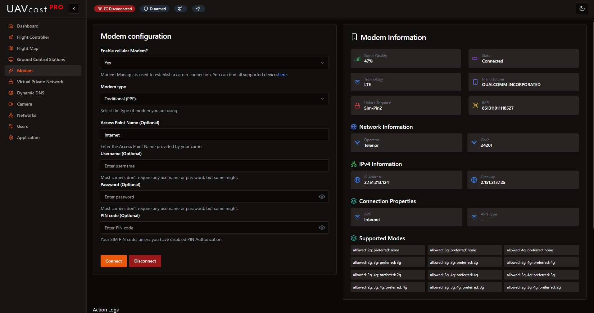

Make sure you are using a supported modem
[https://www.freedesktop.org/wiki/Software/ModemManager/SupportedDevices/](https://www.freedesktop.org/wiki/Software/ModemManager/SupportedDevices/)

E3372**S** or E3372**H**, has proven to be a good modem for these types of application.

## Model
* Options: `Traditional (Stick), HiLink`

Select your modem type based on the model suffix:
- **E3372H or E3276H** → HiLink mode
- **E3372S or E3276S** → Traditional (Stick) mode

### Difference Between HiLink and Traditional Modems

**HiLink Modems:**
- Acts as a USB network adapter/router
- Plug-and-play (automatic DHCP)
- Has own web interface at `192.168.8.1`
- Easier setup, less control

**Traditional (Stick) Modems:**
- Appears as a serial device (`/dev/ttyUSB0`)
- Uses ModemManager for connection
- More control via AT commands
- Better Linux integration

:::tip
Traditional modems are recommended for better integration with UAVcast-Pro and network management features.
:::

## Access Point Name (APN)
* Default value: `internet`

This value is operator specific. If you don't know yours, then contact your cell operator and ask for a proper APN name.
Operators normally have several different APN names. You can find more information here [https://en.wikipedia.org/wiki/Access_Point_Name](https://en.wikipedia.org/wiki/Access_Point_Name)

## Username
* Default value: `blank`

Most carriers don't require any username or password, but some might.
This is operator specific. Contact your cell operator and ask for username if you encounter any issues.

## Password
* Default value: `blank`

Most carriers don't require any username or password, but some might.
This is operator specific. Contact your cell operator and ask for Password if you encounter any issues.

## Pin
* Default value: `blank`

Your simcard Pin Code.  It's recommended to disable the pin to get faster connection on startup.
