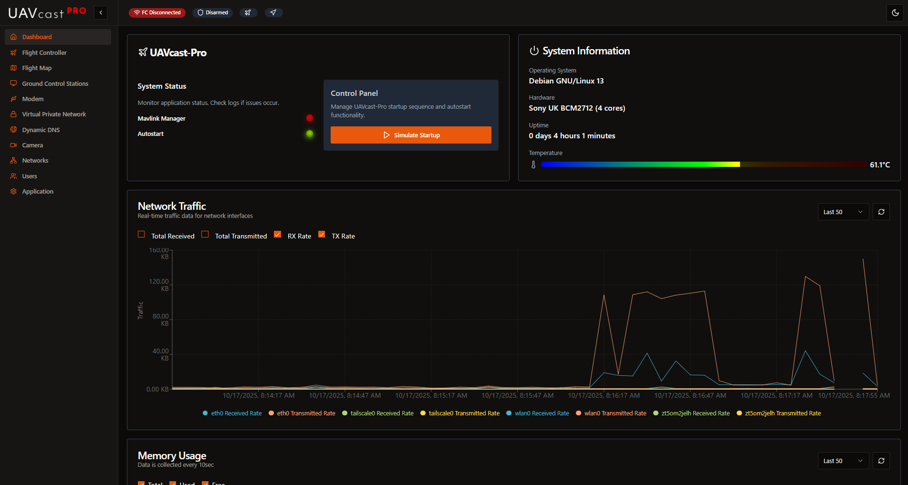

# Dashboard

The Dashboard is your central hub for monitoring UAVcast-Pro's status and your Raspberry Pi's system health. It provides real-time information about services, system resources, and network connectivity.

## Overview

The Dashboard displays several information cards that update in real-time:

- **System Information** - Raspberry Pi model, OS version, and hostname
- **Memory Usage** - RAM utilization with percentage and available memory
- **Storage** - SD card usage and available disk space
- **Network Statistics** - Bandwidth usage for all active network interfaces
- **Service Status** - Real-time status of all UAVcast-Pro services
- **CPU Metrics** - Temperature, voltage, and throttling status

## System Information Card

Displays essential system details:

- **Device Model**: Raspberry Pi model (e.g., Raspberry Pi 4 Model B)
- **OS Version**: Current Raspberry Pi OS version
- **Hostname**: Network hostname of your device
- **Uptime**: How long the system has been running
- **CPU Architecture**: Confirms 64-bit operation (aarch64)

## Memory Usage
Real-time RAM monitoring:

- **Used Memory**: Current memory consumption
- **Total Memory**: Total available RAM
- **Percentage**: Memory utilization percentage
- **Visual Meter**: Progress bar or graph showing usage

:::tip Performance
If memory usage consistently exceeds 80%, consider:
- Closing unnecessary applications
- Disabling unused services
- Upgrading to a Raspberry Pi with more RAM
:::

## Storage Information
SD card space monitoring:

- **Used Space**: How much storage is consumed
- **Available Space**: Free space remaining
- **Total Capacity**: SD card size
- **Percentage**: Storage utilization

:::warning Low Storage
UAVcast-Pro requires free space for:
- Log files
- Video recordings (if enabled)
- Database operations
- System updates

Maintain at least 1GB of free space for optimal operation.
:::

## Network Statistics
Real-time bandwidth monitoring for all network interfaces:

- **Interface Name**: eth0 (Ethernet), wlan0 (WiFi), usb0 (Modem), zt0 (ZeroTier), etc.
- **Upload Speed**: Current data transmission rate
- **Download Speed**: Current data reception rate
- **Total Uploaded**: Cumulative data sent since boot
- **Total Downloaded**: Cumulative data received since boot

Statistics update every 10 seconds by default.

## Service Status
Real-time status of UAVcast-Pro services:

Each service shows a status indicator:
- 🟢 **Green**: Service running normally
- 🔴 **Red**: Service stopped or error
- 🟡 **Yellow**: Service starting/stopping

## CPU Metrics
### Temperature Monitoring

Displays current CPU temperature with color-coded warnings:

- **Green** (< 60°C): Normal operation
- **Yellow** (60-75°C): Elevated temperature
- **Orange** (75-80°C): High temperature
- **Red** (> 80°C): Critical - throttling likely

:::warning Overheating
If CPU temperature consistently exceeds 75°C:
- Ensure proper ventilation
- Add a heatsink or cooling fan
- Avoid direct sunlight
- Check case airflow
:::

### Voltage and Throttling Detection

The dashboard monitors power supply health:

- **Under-voltage Detected**: Power supply cannot provide sufficient voltage
- **CPU Throttling**: Performance reduced due to heat or power issues

:::danger Power Supply Issues
**Under-voltage** indicates an inadequate power supply. This can cause:
- System instability
- Crashes and reboots
- SD card corruption
- Service failures

**Solution**: Use a quality 5V/3A power supply or UBEC. Do not power from servo rail.
:::

### Throttling Icons

- 🟢 **Green**: No throttling, optimal performance
- 🔴 **Red**: Active throttling or under-voltage detected

## Next Steps

From the Dashboard, you can quickly access configuration pages:

- [Flight Controller](/docs/6.x/configuration-flight-controller) - Configure MAVLink connection
- [Camera](/docs/6.x/configuration-camera) - Set up video streaming
- [Ground Control Stations](/docs/6.x/configuration-ground-controller) - Add GCS destinations
- [VPN/Private Network](/docs/6.x/configuration-vpn) - Configure ZeroTier or Tailscale
- [Application Settings](/docs/6.x/configuration-settings) - System configuration
