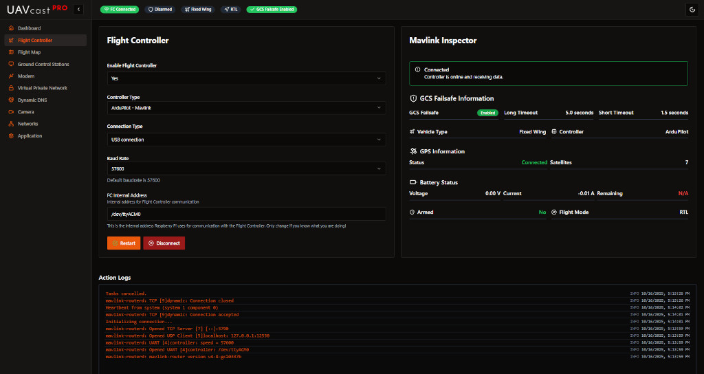

# Flight Controller

The Flight Controller page allows you to configure the MAVLink connection between your Raspberry Pi and flight controller. UAVcast-Pro supports any MAVLink-compatible flight controller including Pixhawk, APM, Cube, and other ArduPilot or PX4-based systems.

## Overview

UAVcast-Pro uses `mavlink-routerd` to manage MAVLink telemetry routing. This allows you to:
- Connect your flight controller via USB or Serial
- Route telemetry to multiple ground control stations
- Monitor connection health in real-time
- Configure baud rates and communication parameters

## Connection Method
Choose how your flight controller connects to the Raspberry Pi:

### USB Connection (Recommended)

- **Advantages:**
  - Plug-and-play, auto-detected
  - More reliable connection
  - No GPIO pin configuration needed
  - Supports hot-plugging

- **Device Detection:**
  - Most flight controllers appear as `/dev/ttyACM0`
  - Some may use `/dev/ttyUSB0`
  - UAVcast-Pro auto-detects the correct device

:::tip Best Practice
USB is the recommended connection method for most setups. It's more reliable and easier to configure than Serial/GPIO.
:::

### Serial/GPIO Connection

- **Advantages:**
  - Saves USB ports
  - More compact physical setup
  - Direct hardware connection

- **Requirements:**
  - Connect flight controller TELEM port to Raspberry Pi GPIO:
    - TX (Flight Controller) → RX (GPIO 15, Pin 10)
    - RX (Flight Controller) → TX (GPIO 14, Pin 8)
    - GND → GND (Pin 6 or any ground pin)
  - Enable serial port in Raspberry Pi configuration
  - Disable serial console (if enabled)

- **Device Path:** `/dev/ttyAMA0` (or `/dev/serial0` on some models)

## Configuration Options

### Baud Rate

- **Default value:** `57600`
- **Common options:** `9600`, `57600`, `115200`, `230400`, `460800`, `921600`

Select the baud rate that matches your flight controller's telemetry port configuration.

**Common baud rates by flight controller:**
- **Pixhawk/Cube (ArduPilot):** 57600 or 115200
- **Pixhawk (PX4):** 57600
- **APM:** 57600
- **Modern flight controllers:** Can support up to 921600

:::tip Performance
Higher baud rates (115200+) allow faster telemetry updates but require quality cables. Start with 57600 for reliability.
:::

### Internal Telemetry Address
This is the internal address UAVcast-Pro uses for routing telemetry.

- **Default value:** `127.0.0.1:14550`
- **Format:** `IP:PORT`

**When to change:**
- Advanced routing scenarios
- Custom MAVLink router configurations
- Integration with other onboard services

:::info Leave Default
For most users, the default value works perfectly. Only change if you have specific routing requirements.
:::

### Enable Flight Controller

Toggle to enable or disable the flight controller service.

- **Enabled:** MAVLink router starts and telemetry is routed
- **Disabled:** Service stopped, no telemetry routing

## Connection Status

:::note Image Placeholder
📸 **Screenshot needed:** Connection status indicator showing connected state
:::

The page displays real-time connection status:

- 🟢 **Connected:** MAVLink HEARTBEAT messages received
- 🔴 **Disconnected:** No HEARTBEAT detected
- 🟡 **Connecting:** Service starting up

### What is Monitored:

- **HEARTBEAT Messages:** Confirms active MAVLink communication
- **Message Rate:** Number of messages per second
- **System ID:** Flight controller's MAVLink system ID
- **Component ID:** MAVLink component identifier
- **Autopilot Type:** Detected autopilot (ArduPilot, PX4, etc.)

## Service Controls

### Start/Stop Service

Control the MAVLink router service:

- **Start:** Begins telemetry routing
- **Stop:** Halts all telemetry communication
- **Restart:** Stops and starts the service (useful after configuration changes)

:::tip Configuration Changes
After changing baud rate or connection method, restart the service for changes to take effect.
:::

## Troubleshooting

### No Connection / Red Status

**Problem:** Flight controller shows disconnected status

**Solutions:**

1. **Check Physical Connection:**
   - Verify USB cable is securely connected
   - Try a different USB port
   - Use a quality USB cable (cheap cables can cause issues)
   - For Serial: verify GPIO wiring is correct

2. **Verify Baud Rate:**
   - Ensure baud rate matches flight controller configuration
   - Check flight controller parameters (e.g., `SERIAL1_BAUD` in ArduPilot)
   - Try common rates: 57600, 115200

3. **Check Device Path:**
   - For USB, verify device appears: `ls -l /dev/ttyACM*` or `ls -l /dev/ttyUSB*`
   - For Serial: `ls -l /dev/ttyAMA0` or `/dev/serial0`
   - Check kernel messages: `dmesg | grep tty`

4. **Flight Controller Configuration:**
   - Ensure telemetry output is enabled on the port
   - Verify MAVLink protocol is selected (not MSP or other protocols)
   - Check flight controller is powered and initialized

5. **Service Status:**
   - Check if mavlink-routerd is running: `sudo systemctl status mavlink-manager`
   - View system logs: `journalctl -u mavlink-manager -f`

### MAVLink Protocol Versions

UAVcast-Pro supports:
- **MAVLink v1:** Legacy protocol
- **MAVLink v2:** Modern protocol with signing and extensions

The router auto-detects protocol version.

## Best Practices

1. **Use USB Connection** for simplicity and reliability
2. **Start with 57600 baud** and increase if needed
3. **Test connection before flight** using the status indicator
4. **Monitor logs** if experiencing connection issues
5. **Keep cables short** (< 1 meter for USB)
6. **Use quality cables** - cheap cables cause signal integrity issues
7. **Secure connections** - vibration can disconnect loose cables

## Related Pages

- [Ground Control Stations](/docs/6.x/configuration-ground-controller) - Configure telemetry destinations
- [Dashboard](/docs/6.x/configuration-dashboard) - Monitor flight controller status
- [Flight Map](/docs/6.x/configuration-map) - View live telemetry on map
- [Troubleshooting Guide](/docs/6.x/faq) - Common issues and solutions

## Next Steps

After configuring your flight controller:

1. Verify connection status shows 🟢 Connected
2. Configure [Ground Control Stations](/docs/6.x/configuration-ground-controller) to route telemetry
3. Set up [VPN](/docs/6.x/configuration-vpn) for remote access
4. View live telemetry on the [Flight Map](/docs/6.x/configuration-map)
