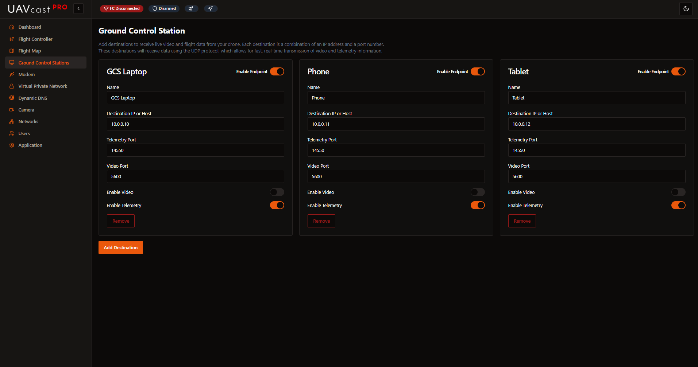

# Ground Control Stations



The Ground Control Stations (GCS) page allows you to configure multiple destinations for telemetry and video streaming. UAVcast-Pro v6 supports routing MAVLink telemetry and video to multiple ground stations simultaneously.

## Overview

UAVcast-Pro v6 can stream to multiple GCS destinations, including popular software such as:
- Mission Planner (Windows)
- QGroundControl (Windows/Mac/Linux/Android)
- APM Planner 2

Each destination can be individually configured for:
- Telemetry streaming (MAVLink)
- Video streaming
- Custom IP addresses and ports

## Adding a GCS Destination

To add a new ground control station:

1. Click **Add Destination** button
2. Fill in the configuration form:
   - **Name**: Descriptive name (e.g., "Laptop Mission Planner", "Tablet QGC")
   - **Destination IP**: IP address of the GCS computer
   - **Telemetry Port**: UDP port for MAVLink (default: 14550)
   - **Video Port**: UDP port for video stream (default: 5600)
   - **Enable Telemetry**: Toggle to enable/disable telemetry streaming
   - **Enable Video**: Toggle to enable/disable video streaming


## Configuration Fields

### Name

A friendly name to identify this destination.

**Examples:**
- "Mission Planner - Laptop"
- "QGC - Android Tablet"
- "MAVProxy - Ground Station"
- "Backup GCS"

### Destination IP Address
The IP address of the computer running your ground control software.

:::tip Finding IP Address
**On GCS Computer:**
- **Windows**: Open CMD, run `ipconfig`, look for ZeroTier or Tailscale adapter
- **Linux**: Run `ip addr` or `ifconfig`, find zt0 or tailscale0 interface
- **Mac**: System Preferences → Network, select VPN interface
- **Android**: ZeroTier app shows managed IP
:::

:::warning Use VPN IP
Always use the VPN IP address (ZeroTier/Tailscale), not your local network IP, when operating remotely via cellular connection.
This ensures connectivity over secure VPN.
:::

### Telemetry Port

- **Default:** 14550 (MAVLink standard)
- **Protocol:** UDP
- **Range:** 1024-65535

Most ground control stations listen on port 14550 by default.

**Port requirements by GCS:**
- **Mission Planner:** 14550 (configurable)
- **QGroundControl:** 14550 (auto-detect)
- **APM Planner 2:** 14550
- **MAVProxy:** User-defined

### Video Port

- **Default:** 5600
- **Protocol:** UDP
- **Range:** 1024-65535

Port for H.264 video streaming.

**Port requirements by GCS:**
- **Mission Planner:** 5600 (default HUD video)
- **QGroundControl:** 5600 (auto-detect)
- **Custom:** Any port your receiver listens on

### Enable Telemetry

Toggle to control whether MAVLink telemetry is sent to this destination.

- **ON:** Telemetry data streamed via UDP
- **OFF:** No telemetry sent (saves bandwidth)

Use case: Disable telemetry for video-only monitoring stations.

### Enable Video

Toggle to control whether video is sent to this destination.

- **ON:** Video stream sent via UDP
- **OFF:** No video sent (saves bandwidth)

Use case: Disable video for telemetry-only connections or low-bandwidth links.

## Ground Control Software Setup

### Mission Planner (Windows)
Mission Planner auto-connects on UDP 14550.

1. Open Mission Planner
2. Top-right dropdown: Select **UDP**
3. Click **Connect**
4. Telemetry should appear automatically

**For video:**
- Video appears in HUD on port 5600 automatically
- If not: Right-click HUD → Video → Use default settings

### QGroundControl
QGC auto-detects UDP telemetry.

1. Open QGroundControl
2. Telemetry auto-connects (no configuration needed)
3. Video auto-appears on port 5600

**Manual configuration (if needed):**
- Application Settings → Comm Links → Add
- Type: UDP
- Port: 14550

## Firewall Configuration

:::warning Critical
Your GCS computer firewall must allow incoming UDP traffic on the configured ports.
:::

### Windows Firewall

```powershell
# Allow telemetry port
New-NetFirewallRule -DisplayName "MAVLink Telemetry" -Direction Inbound -Protocol UDP -LocalPort 14550 -Action Allow

# Allow video port
New-NetFirewallRule -DisplayName "UAV Video" -Direction Inbound -Protocol UDP -LocalPort 5600 -Action Allow
```

Or via GUI:
1. Windows Defender Firewall → Advanced Settings
2. Inbound Rules → New Rule
3. Port → UDP → Specific local ports: 14550, 5600
4. Allow the connection
5. Apply to all profiles

### Linux (UFW)

```bash
sudo ufw allow 14550/udp comment 'MAVLink Telemetry'
sudo ufw allow 5600/udp comment 'UAV Video'
```

### macOS

```bash
# macOS firewall typically allows incoming UDP by default
# If issues occur, disable firewall temporarily for testing:
# System Preferences → Security & Privacy → Firewall
```

### Android (QGroundControl)

No firewall configuration needed - Android allows incoming UDP.

## Troubleshooting

### No Telemetry Received

**Problem:** GCS shows "Waiting for connection" or "No heartbeat"

**Solutions:**

1. **Verify Flight Controller is Connected:**
   - Check [Flight Controller](/docs/6.x/configuration-flight-controller) page
   - Status should show 🟢 Connected

2. **Check IP Address:**
   - Confirm you're using the correct VPN IP
   - Windows: `ipconfig` → Find ZeroTier/Tailscale adapter
   - Linux: `ip addr show zt0` or `ip addr show tailscale0`
   - Verify IP matches destination configuration

3. **Verify Firewall:**
   - Test by temporarily disabling firewall
   - If it works, add proper firewall rules
   - Ensure UDP 14550 is allowed inbound

4. **Check VPN Connection:**
   - Both devices must be connected to VPN
   - Verify in ZeroTier/Tailscale dashboard
   - Test with ping: `ping <uavcast-ip>`

5. **Verify Port:**
   - Ensure GCS is listening on port 14550
   - Some GCS software allows custom ports
   - Match UAVcast destination port with GCS listening port

6. **Check Service Status:**
   - Dashboard → Flight Controller should be green
   - View logs: Flight Controller page → Logs


## Related Pages

- [Flight Controller](/docs/6.x/configuration-flight-controller) - Configure MAVLink source
- [Camera](/docs/6.x/configuration-camera) - Configure video streaming
- [VPN/Private Network](/docs/6.x/configuration-vpn) - Set up ZeroTier or Tailscale
- [Dashboard](/docs/6.x/configuration-dashboard) - Monitor connection status
- [Flight Map](/docs/6.x/configuration-map) - View telemetry data on map

## Next Steps

After configuring your GCS destinations:

1. Verify firewall rules on GCS computer
2. Test connection with VPN enabled
3. Confirm telemetry reception in GCS software
4. Test video streaming
5. Configure backup GCS destination
6. Document your configuration for field use
