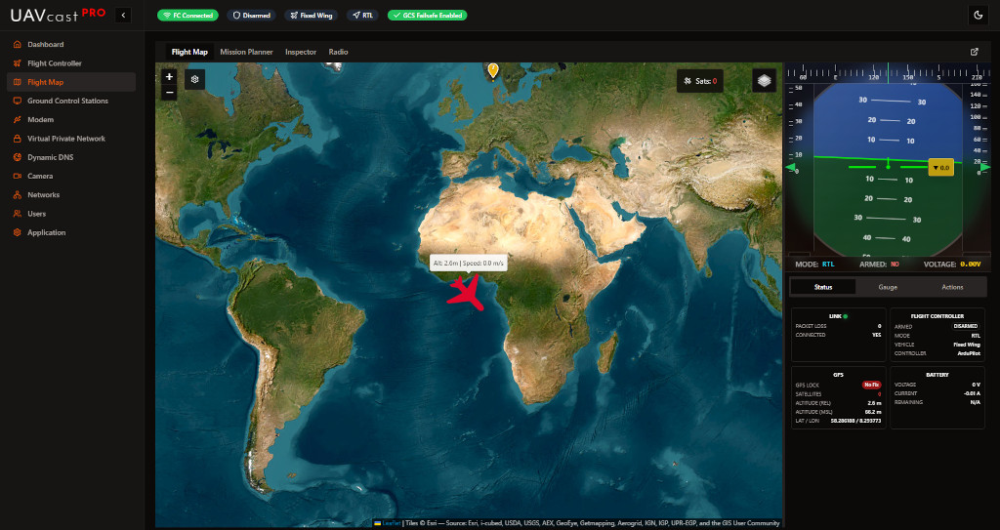

# Flight Map

Flight Map gives you a nice overview of your vehicle position with mavlink telemetry data. Some basic commands can be triggered within the map.

## In browser video
You are able to receive live video feed from your picam within the map. The video container can be scaled and positioned / dragged anywhere in the window.

## Telemetry
Flight Map gives you live telemetry data listed in the sidebar. You can see important information such as GPS coordinates, altitude, speed, battery status and more.

## Commands
You can send some basic commands from the map such as enable GCS failsafe, trigger RTL, Loiter, Pre-flight check and show your missions.