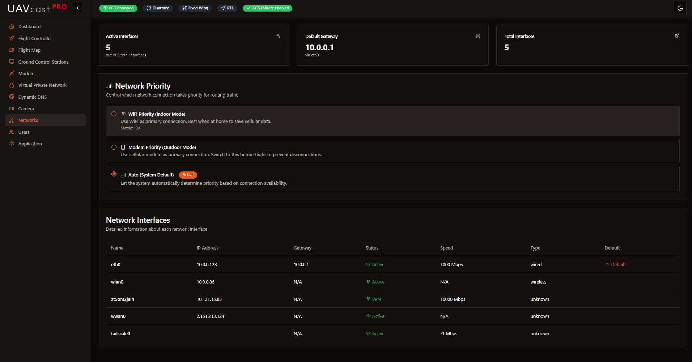

# Networks

The Networks page displays network interface information and allows you to set network priority.

## Network Information

The page shows three summary cards:

- **Active Interfaces** - Number of currently active network interfaces
- **Default Gateway** - Current default gateway IP and interface
- **Total Interfaces** - Total number of detected network interfaces

## Network Priority

Choose which network interface should be preferred:

**WiFi Priority:**
- WiFi (wlan0) will be the primary connection
- System prioritizes WiFi over modem

**Modem Priority:**
- Cellular modem (usb0/wwan0) will be the primary connection
- System prioritizes modem over WiFi

**Auto Priority:**
- System automatically selects best available connection
- Switches based on availability and connection quality

Changes take effect immediately.

## Network Interfaces Table

Displays all detected network interfaces with:

- **Name** - Interface name (eth0, wlan0, usb0, zt0, etc.)
- **IP Address** - Assigned IP address
- **Gateway** - Network gateway
- **Status** - Active (green) or Inactive (red)
- **Speed** - Link speed in Mbps (if available)
- **Type** - Interface type (Ethernet, WiFi, VPN, etc.)
- **Default** - Shows which interface is the default route

Table updates every 10 seconds.

## Common Interface Names

- **eth0** - Ethernet
- **wlan0** - WiFi
- **usb0** - HiLink modem
- **wwan0** - Traditional modem
- **zt0** - ZeroTier VPN
- **tailscale0** - Tailscale VPN
- **lo** - Loopback (ignore this)

## Troubleshooting

**Interface shows Inactive:**
- Check physical connection (cable, modem, etc.)
- Verify interface configuration
- Check if interface is enabled

**No Default Gateway:**
- Check network configuration
- Verify DHCP is working
- Check modem/router connection

**Priority not working:**
- Check both interfaces are active
- Verify connectivity on both interfaces
- Check system routing: `ip route`

## Related Pages

- [Modem Configuration](/docs/6.x/configuration-cell-modem) - Configure cellular modem
- [VPN Configuration](/docs/6.x/configuration-vpn) - Set up ZeroTier or Tailscale
- [Dashboard](/docs/6.x/configuration-dashboard) - View network statistics
