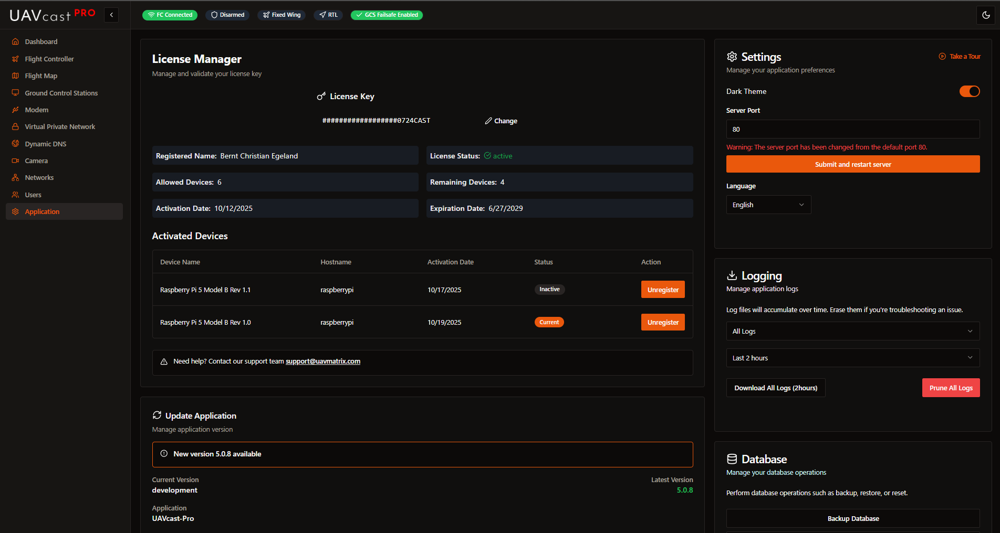

# Application Settings

The Application Settings page allows you to manage your UAVcast-Pro license, update the software, configure application preferences, manage logs, and backup/restore your database.

## License Management

Manage your UAVcast-Pro license key and view license details.

**License Information:**
- License key input/validation
- License status (active/expired)
- Licensed devices list
- Activation/deactivation controls
- Support information

**Actions:**
- Enter or change license key
- View activated devices
- Deactivate devices

:::tip
Your license key is required to use UAVcast-Pro features. Visit [UAVMatrix](https://uavmatrix.com) to purchase or manage your license.
:::

## Application Updates

Keep UAVcast-Pro up to date with the latest features and bug fixes.

**Update Information:**
- Current version
- Latest available version
- Application name
- Update status

**Update Actions:**
1. Select version from dropdown (latest or rollback to previous version)
2. Click update button
3. Monitor installation progress
4. Reboot if required

:::warning Pending Restart
If a system restart is required after an update, you'll see a "Pending Restart" alert with a reboot button.
:::

:::note Browser Refresh
After an update completes, refresh your browser to load the new version.
:::

## General Settings

Configure basic application preferences.

### Dark Theme
Toggle between light and dark mode using the switch.

### Server Port
- **Default port:** 80
- Change the web interface access port
- After changing, access UAVcast-Pro at: `http://<your-pi-ip>:<new-port>`
- Application restarts automatically after port change

:::caution Port Change
When changing the server port, bookmark the new URL. The browser will redirect automatically after a few seconds.
:::

### Language
Select your preferred language:

- English
- Spanish
- Chinese
- Italian
- Dutch
- Polish
- Portuguese
- Russian
- Turkish

If you'd like to contribute translations, contact us via Discord or support email.

### UI Tour
Click "Start Tour" to launch an interactive guide of the UAVcast-Pro interface (available for licensed users).

## Logging

Download or clear application logs for troubleshooting.

**Log Selection:**
Choose which logs to download:
- All logs
- Modem Manager
- VPN Manager
- MAVLink Manager
- Camera Server
- DNS Manager
- License Manager
- UAVcast Installation

**Time Range:**
Select log time range:
- 10 minutes
- 30 minutes
- 60 minutes
- 2 hours
- 6 hours
- 24 hours
- 7 days
- All

**Actions:**
- **Download Logs:** Download selected logs as a zip file
- **Prune Logs:** Clear all log files (requires confirmation)

:::warning Prune Logs
Pruning logs permanently deletes all log files. Only proceed if you're certain you don't need them for troubleshooting.
:::

## Database Management

Backup, restore, or reset your UAVcast-Pro configuration database.

:::danger Admin Only
Database operations require admin user privileges. Standard users will see a notice that admin access is required.
:::

**Actions:**
- **Backup Database:** Download current database file (`uavcast-backup.db`)
- **Restore Database:** Upload and restore a previous backup (`.db` file)
- **Reset Database:** Delete all configuration data (user accounts are NOT deleted)

:::caution Reset Database
Resetting the database removes all your UAVcast-Pro settings including flight controller, camera, GCS destinations, VPN, and modem configurations. User accounts remain intact. You cannot undo this action.
:::

**Backup Best Practices:**
- Create regular backups before major changes
- Keep backups when testing new configurations
- Download backup before updating UAVcast-Pro
- Store backups outside the Raspberry Pi

## Related Pages

- [Dashboard](/docs/6.x/configuration-dashboard) - Monitor system status
- [Users](/docs/6.x/configuration-users) - Manage user accounts
- [Installation](/docs/6.x/installation) - Initial setup and requirements

## Next Steps

After configuring application settings:

1. Set your preferred language and theme
2. Create regular database backups
3. Check for updates periodically
4. Download logs when troubleshooting issues