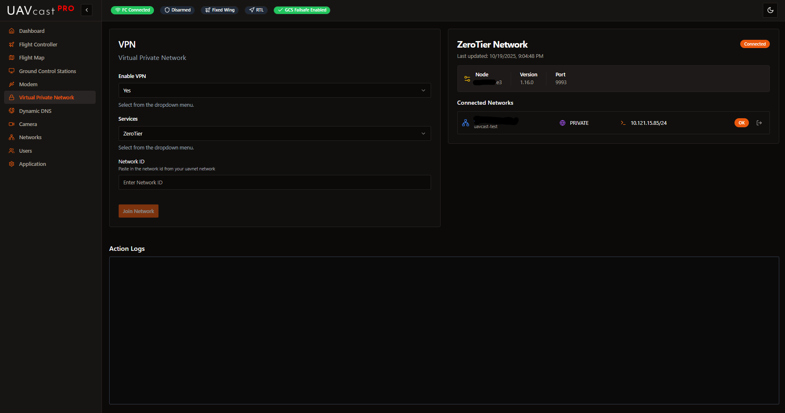

# VPN / Private Network

The VPN page allows you to configure secure remote access to your UAVcast-Pro system using ZeroTier or Tailscale. VPN connections enable you to access your drone and ground control station over the internet without port forwarding or exposing services publicly.

## Overview

UAVcast-Pro v6 supports two VPN services:

**ZeroTier:**
- Peer-to-peer mesh network
- Works behind NAT/firewalls
- Create private networks with unique network IDs

**Tailscale:**
- Built on WireGuard protocol
- Simple setup with web or auth key
- Automatic NAT traversal

Both services establish direct encrypted connections between devices even when behind NAT or firewalls.

## Enable VPN Service

**Enable/Disable VPN:**
- Select "True" to enable VPN service
- Select "False" to disable VPN service
- Must be enabled before selecting a VPN provider

## Select VPN Service

Choose which VPN provider to use:

- **ZeroTier** - Mesh networking service
- **Tailscale** - WireGuard-based VPN

The service dropdown is disabled until you enable VPN.

## ZeroTier Configuration

### Network ID
Enter your ZeroTier network ID (16-character alphanumeric string).

**How to get a ZeroTier Network ID:**

UAVMatrix provides a managed ZeroTier service for paid UAVcast-Pro users:

1. Log in to [https://uavnet.uavmatrix.com](https://uavnet.uavmatrix.com)
2. Create a new ZeroTier network
3. Copy the network ID
4. Paste into UAVcast-Pro
5. Devices are automatically authorized

**Actions:**
- **Join Network:** Connect to the ZeroTier network
- **Leave Network:** Disconnect from the network

**After joining:**
1. Go to your ZeroTier management page [UAVNet](https://uavnet.uavmatrix.com
2. Find your network
3. Authorize the new device (Raspberry Pi) if not using UAVNet
4. Note the assigned IP address

:::tip
ZeroTier creates a virtual network interface (usually `zt0`) visible in the Networks page.
:::

## Tailscale Configuration

Tailscale offers two authentication methods.

### Web Authentication (Recommended)

1. Select "Web" tab
2. Click "Open Tailscale Login"
3. Authenticate in your browser
4. Return to UAVcast-Pro (connection happens automatically)

This method is simpler and doesn't require generating auth keys.

### Auth Key Authentication

1. Select "Key" tab
2. Generate auth key at [https://login.tailscale.com/admin/settings/keys](https://login.tailscale.com/admin/settings/keys)
3. Enter auth key in UAVcast-Pro
4. Optionally set a custom hostname
5. Click "Connect with Auth Key"

**Auth Key Settings:**
- **Reusable:** Yes (recommended for testing)
- **Ephemeral:** Optional (device removed when offline)
- **Pre-authorized:** Yes (auto-approve device)

:::note Hostname
Custom hostname makes your device easier to identify in the Tailscale admin panel. If not specified, the system hostname is used.
:::

**Connection Status:**
- When connected, you'll see a green "Connected" alert
- Tailscale creates a virtual interface (usually `tailscale0`)

## VPN Information Panel

Displays real-time VPN status and connection details.

**When VPN is disabled:**
- Shows "No VPN Information" message
- Lists steps to enable VPN

**When ZeroTier is enabled:**
- Network ID
- Connection status
- Assigned IP address
- Network members

**When Tailscale is enabled:**
- Connection status
- Assigned Tailscale IP
- Hostname
- Account information

## Service Logs

Real-time logs from the VPN manager showing:
- Connection attempts
- Authentication status
- Network events
- Error messages

## Related Pages

- [Networks](/docs/6.x/configuration-networks) - Configure network priority and view VPN interface
- [Ground Control Stations](/docs/6.x/configuration-ground-controller) - Add GCS destinations via VPN
- [Dashboard](/docs/6.x/configuration-dashboard) - Monitor VPN service status
- [Camera](/docs/6.x/configuration-camera) - Stream video over VPN

## Next Steps

After setting up VPN:

1. Test VPN connectivity from ground station
2. Add GCS destination using VPN IP address
3. Configure network priority if using multiple interfaces
4. Test MAVLink and video streaming over VPN
