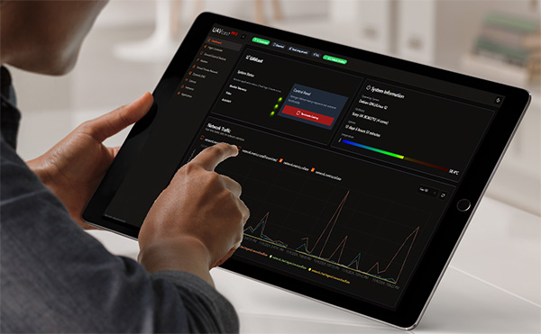

# UAVcast-Pro v6 Documentation

 

Welcome to the documentation for UAVcast-Pro v6, a comprehensive 4G LTE drone software solution designed for Raspberry Pi companion computers. This software enables cellular connectivity, real-time telemetry streaming, live video transmission, and complete flight management for your drone operations.

## What's New in Version 6

UAVcast-Pro v6 is a complete rewrite with modern architecture and enhanced capabilities:

- **Backend Rewritten in Rust** - High-performance, memory-safe core services for improved reliability and efficiency
- **Modern React-based UI** - Fast, responsive interface with real-time updates
- **Enhanced Flight Map** - Interactive Leaflet-based map with live UAV tracking, flight path visualization, and mission waypoints
- **Live Camera Preview** - Built-in HLS video player for immediate visual feedback
- **Multiple GCS Support** - Configure and manage multiple ground control station destinations
- **Advanced Network Management** - Network interface priority, automatic switchover, and bandwidth monitoring
- **Dual VPN Support** - Choose between ZeroTier or Tailscale for secure connections
- **User Management** - Multi-user support with role-based access control (Admin/Read-only)
- **Real-time Monitoring** - Live system metrics, telemetry data, and service status
- **Mission Planning** - Integrated mission planner for waypoint management

## Key Features

### Flight Control & Telemetry
- MAVLink protocol support with configurable baud rates
- USB and Serial connection options
- Real-time telemetry streaming to multiple ground stations
- Flight controller status monitoring

### Video Streaming
- Support for Raspberry Pi Camera and USB cameras
- Configurable resolution, FPS, and bitrate
- HLS-based live preview in web interface
- Custom GStreamer pipeline support
- Multiple streaming protocols (UDP/TCP)

### Connectivity
- 4G/LTE modem support (Traditional and HiLink types)
- Dual VPN providers (ZeroTier and Tailscale)
- Dynamic DNS integration
- Network interface management and failover
- Bandwidth monitoring

### System Management
- Web-based configuration interface
- Real-time system monitoring (CPU, memory, storage, temperature)
- Service management and logging
- Database backup and restore
- License management

## Supported Hardware

- **Raspberry Pi Models**: Zero 2W, 3, 4, 5, or newer
- **Operating System**: Raspberry Pi OS 64-bit (required)
- **Flight Controllers**: Any MAVLink-compatible controller (Pixhawk, ArduPilot, PX4, etc.)
- **Cameras**: Raspberry Pi Camera modules, Logitech C615/C920, and custom cameras
- **Modems**: Most 4G/LTE USB modems and HiLink devices

## Getting Help

For questions or support, please contact us through our official channels:

- UAV community [https://discuss.uavmatrix.com](https://discuss.uavmatrix.com)
- Discord live chat [https://discord.gg/xwqMTXh](https://discord.gg/xwqMTXh)
- Support Mail **support@uavmatrix.com**

## Quick Links

- [Installation Guide](/docs/6.x/installation)
- [Quick Start Tutorial](/docs/6.x/quick-start)
- [Hardware Requirements](/docs/6.x/get-started-hardware)
- [License Activation](/docs/6.x/get-started-license)

