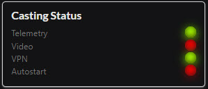

#Dashboard

Dashboard provides a overview of the current casting status and Raspberry Pi internal memory and storage. There is one LED for each item you have enabled in the menu, displaying green or red status of its current operating state.

##Start / Stop UAVcast-Pro
You can start and stop UAVcast-Pro from the dashboard. This will simulate the exact start up sequence when Raspberry Pi boots up (if autoboot is enabled).
If you get all green led's then all selected items have started as expected.

This is a nice way to verify that UAVcast-Pro will start as expected when Raspberry Pi starts up.

##Enable  / Disable Autostart

If autostart is enable, then UAVcast-Pro will start all enabled functions every time Raspberry Pi boots up.

##CPU

Under-voltage detection, CPU throttling and temperature is shown on the dashboard. When an under-voltage or CPU throttling is detected these icons will turn from green to red.

!!! warning
    It is recommended to use a stable 5v power supply for the Raspberry Pi, this can be achieved using a UBEC or similar. It is not recommended to power your Raspberry Pi from the servo rail as voltage drop can occur.

##Network Statistics

You are able to view network statistics from the dashboard for all network adapters that have been configured - These stats update every 10 seconds.

##Storage / Memory

Overview of free space and used memory
