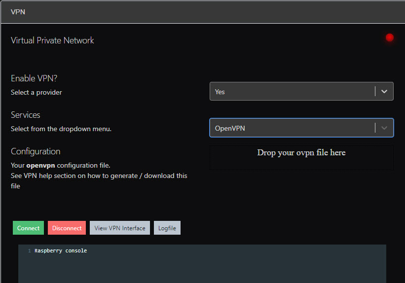

UAVcast currently supports Zerotier and OpenVPN without the need for any additional software running on the Raspberry Pi.

VPN page Overview

##Zerotier
Zerotier establishes a direct connection between the connected devices, even if they are behind a NAT.

!!! note
Depending on your cellular providers NAT policy - if you are having issues with video streaming over UDP, try using a TCP for your connections or try OpenVPN.

<iframe width="854" height="480" src="https://www.youtube.com/embed/p3DZxDkI5M0?rel=0" frameborder="0" allow="accelerometer; autoplay; encrypted-media; gyroscope; picture-in-picture" allowfullscreen></iframe>

##OpenVPN

OpenVPN connects devices togheter using server in-the-middle principle.
Many cloud services has prebuildt servers with openvpn for easy startup.

- [Digitalocean openvpn access server](https://marketplace.digitalocean.com/apps/openvpn-access-server)
- [Google Cloud openvpn access server](https://openvpn.net/google-cloud-vpn)

When you have started your vpn access server, login and add a user / client.
For the user you want to asign to UAVcast, make sure you have ticked the **auto-login** box.

Now, login with your newly created user https://your_openvpn_ip:943/

Download the **(Yourself- Autologin profile)**

Drag this file into uavcast => vpn page and hit connect.

For more information about setting up OpenVPN, please see the [Open VPN Wiki](https://community.openvpn.net/openvpn/wiki).
