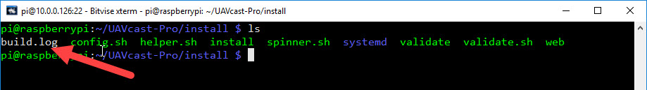
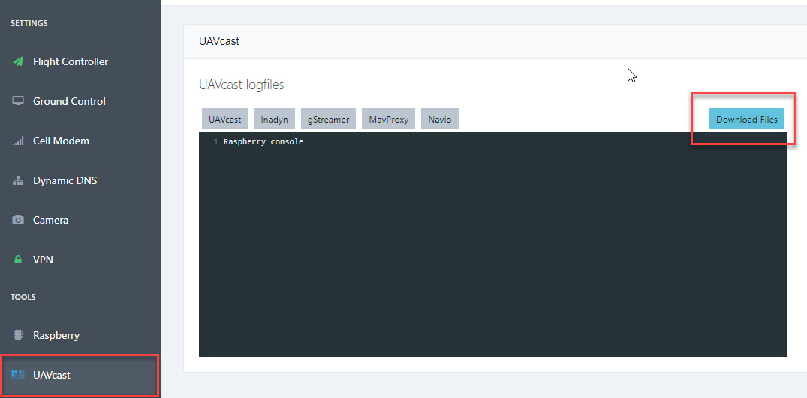

You can at any time contact us at **uavmatrix@uavmatrix.com** or chat privately on our Discord server [https://discord.gg/xwqMTXh](https://discord.gg/xwqMTXh) or use our forum section
[https://discuss.uavmatrix.com](https://discuss.uavmatrix.com)
##FAQ

#Where can i download latest version?

- See the [installation](/installation/#uavcast-pro-installation) instructions

#Cannot activate UAVcast-Pro license

- Make sure you have proper internet connection for your RPI. During the validation, RPI needs to contact uavmatrix.com license server for validation.

#Installation validation fails.

- Make sure you use a supported raspberry image as decribed in the [installation instructions](/installation/#raspberry-pi-image).
- For other installation issues, please navigate to `UAVcast-Pro/install` folder and copy the `Installation.log` to your computer.
  Create a new discussion in our forum [discuss.uavmatrix.com](https://discuss.uavmatrix.com) and attach the file.

#Im not able to receive video or telemetry

- Make sure you have added video and telemetry port to your firewall rules.
- Verify that you have proper connection with your flight controller. You can run the connection test from the Flight Controller page.
- If you have changed the default ports for video 5600 or telemetry 14550 you need to change this on your ground control station device as well.

#Validate Mavlink Connection allways fails in UAVcast-Pro

- Make sure you are using a good USB cable with large cross-sectional area to minimize the voltage drop supplied to Fligth Controller.
- If you are connected by GPIO pins, make sure you have connected the **ground, rx, tx** wires correctly.
- Make sure you use default configuration in Flight Controller (Ardupilot, Px4) for UART / Telemetry ports.

#Cant receive video, but telemetry works

- [PiCam] Please make sure you have enabled PiCam in the Raspberry config **raspi-config**
- [Logitech cams] Check logfiles and see if there is any errors. If you see **Internal data stream error** its most likey a unsupported resoultion or fps. Try play with those settings.

#Other Application issues.

- If you experience any issues with UAVcast running on your Raspberry, please Navigate to the UAVcast page and
  press "Download Logfiles" button. This will download a zip file containing all logs related to UAVcast and its running components.
  Log content will only contain application data and not user data.

      Create a new discussion in our forum [discuss.uavmatrix.com](https://discuss.uavmatrix.com) and attach the zip file, or mail it to our support department support@uavmatrix.com

      
