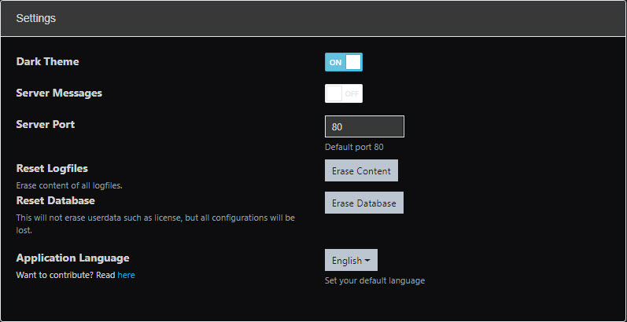
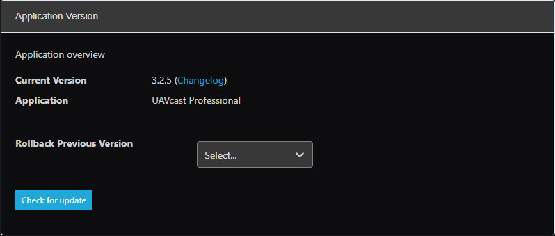

## Dark Theme
Dark mode can be enabled from the settings page.

## Server messages
This will allow UAVcast to populate a notification card when server notice an error.

Messages:

-   Power (undervoltage detection)
-   CPU throttling due to undervoltage or high load.

## Server Port

You are able to change the access port for UAVcast-Pro from the default port of 80.

## Reset Logfiles
Each function in UAVcast stores all operations to logfiles, and to start on a fresh file you can reset them here.

## Reset Database
Delete all configuration you have made in UAVcast-Pro. User data will NOT be deleted!

## Alternate Languages
Select a prefered lanuage. 

-   English
-   Simplified Chinese 
-   Turkish
-   Spanish
-   Russian
-   Polish
-   Dutch
-   Italien
-   Portuguese

If you would like to contribute to UAVcast-Pro by adding a new language, please follow the instructions [here](configuration-developers).

## Updates

UAVcast is regularly updated, to check if there are any updates available for your installation click the "Check for Update" button.

:::note
    Once an update has been completed - please refresh your browser.
:::