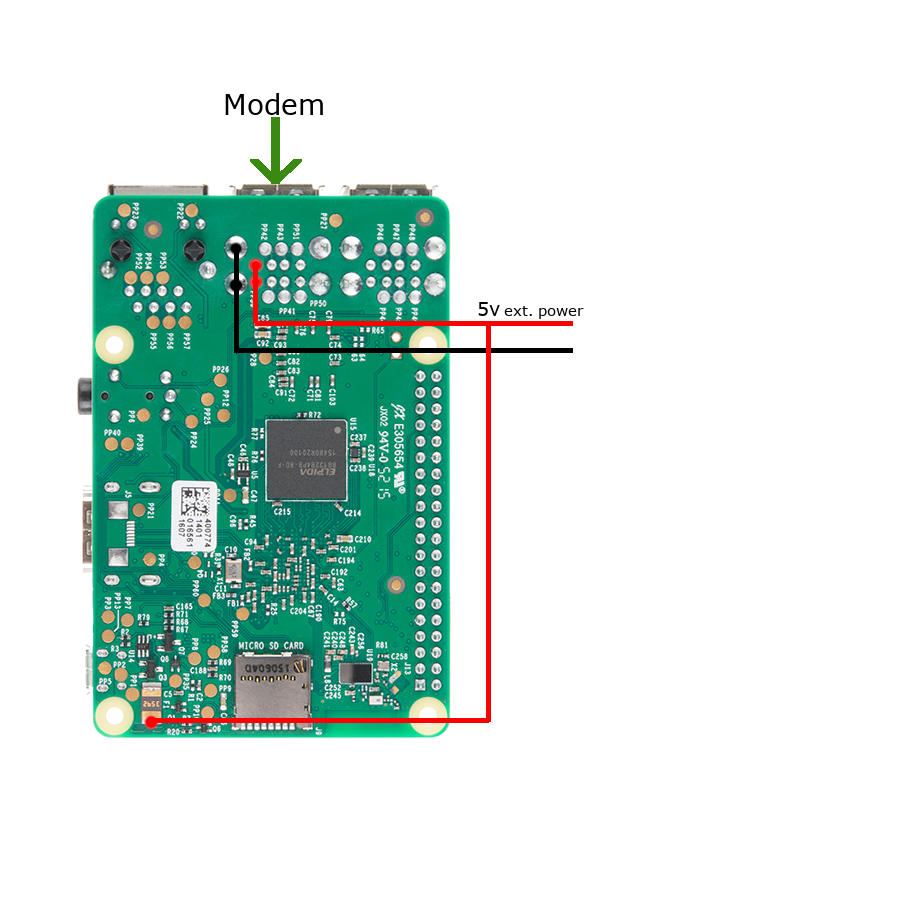

<!-- prettier-ignore -->
# Hardware

## TL;DR
To get started, you'll need a Raspberry Pi and a MAVLink flight controller. For local testing within your home network, a WiFi or Ethernet connection is sufficient - no modem is required. However, once you're ready for actual flight operations, you'll need a modem. We recommend using a HiLink (Plug and Play) type modem for the best experience.

For manual drone control during flight, we recommend connecting a USB gamepad to Mission Planner using its joystick integration feature.

See additional details below.

## Flight Controllers

All MAVLink-based flight controller boards are supported, including both PX4 and Ardupilot systems.

The Ardupilot project continuously adds support for new flight controllers. You can find the complete list of supported flight controllers at [http://ardupilot.org/plane/docs/common-autopilots.html](http://ardupilot.org/plane/docs/common-autopilots.html).

Here are some of our supported boards:

- Pixhawk
- APMx
- Cube
- Matek
- Navio+
- Navio2

### Connection Methods
There is two ways to connect the FC to Raspberry PI, either using USB (preferred) or GPIO
There is no diffrence in performance but the USB connection is easier and more elegant.

#### USB

- Connect a micro USB cable between the FC and RPI as shown in the picture bellow.

:::warning USB cross-sectional

    Use a USB cable with large cross-sectional area to minimize the voltage drop supplied to Fligth Controller.
:::

#### GPIO

- Its very imporant to connect tx, rx and ground if you want to use GPIO, and not only tx & rx.

:::warning
    RPI cannot be powered by FC telem port.  [Make sure you use proper power source for rpi.](/hardware/#power-supply)
:::

## Supported Raspberry Pi boards

- Pi0w
- PI 2
- Pi 3
- Pi 4

:::warning Pi0w

    Pi0w runs fine with UAVcast-Pro, however the CPU usage will be between 50 > 100%.
    Some functionalities has been disabled to reduce the CPU load!
:::

If you intend to use other programs with UAVcast-Pro then Pi3 or 4 version is recommended.

##Power supply
It's important that Raspberry Pi gets voltage between **4.8 and 5.3v**. If you use LTE modem, make sure you are not overloading the USB port per. design.

Read the modem specification / datasheet and make sure the modem is not consuming more than MAX output defined in the table below.

:::info USB Camera

    If you use USB camera, make sure you include the camera consumption as well.
:::

[https://www.raspberrypi.com/documentation/computers/raspberry-pi.html#typical-power-requirements](https://www.raspberrypi.com/documentation/computers/raspberry-pi.html#typical-power-requirements)

- **Limited by PSU** referes the value from the (Recommended PSU current capacity). Make sure you use a proper power supply that are able to deliver above this value.

  

If you need to add external power, please see instructions bellow.
This is one solution, where we attach the power directly to the USB +/- pins, and one wire to the RPI fuse. The latter will make sure RPI is booting automatically when powered.

:::note

    Make sure you connect the modem to correct USB port where external power supply is connected.
:::

## Modem

UAVcast uses modem manager and network manager to control the LTE connection.
Check out this page to find supported modems, [Supported modem](https://www.freedesktop.org/wiki/Software/ModemManager/SupportedDevices/)

###Recommended Huawei HiLink modems by Countries

:::note

    Please send a mail to **support@uavmatrix.com** or open a new PR on [github](https://github.com/UAVmatrix/uavcast-pro-docs) if you know of other working Huawei modems in your country!
:::

|    Country     |        Carrier         |            Recommended Modem            |                            Recommended APN                             |
| :------------: | :--------------------: | :-------------------------------------: | :--------------------------------------------------------------------: |
|   Australia    |        Telstra         |        E3372h-153 E3372h-607         |                    telstra.wap  telstra.internet                    |
|    Austria     | bob A1 Telekom Austria |        E3372h-153 E3372h-607         |                                 bob.at                                 |
|    Bulgaria    |        Vivacom         |        E3372h-153 E3372h-607         |                          internet.vivacom.bg                           |
| Czech Republic |           O2           |        E3372h-153 E3372h-607         |                                internet                                |
| Czech Republic |        Vodafone        |        E3372h-153 E3372h-607         |                                internet                                |
|     France     |        Bouygues        |        E3372h-153 E3372h-607         |                            mmsbouygtel.com                             |
|     France     |         Orange         |        E3372h-153 E3372h-607         |                           orange.fr / orange                           |
|     France     |          SFR           |        E3372h-153 E3372h-607         |                                 websfr                                 |
|    Germany     |        T-Mobile        |        E3372h-153 E3372h-607         |                            internet.t-d1.de                            |
|    Germany     |           O2           |        E3372h-153 E3372h-607         |                                internet                                |
|    Germany     |        Vodafone        |        E3372h-153 E3372h-607         |                            web.vodafone.de                             |
|     Greece     |        Cosmote         |        E3372h-153 E3372h-607         |                                internet                                |
|     Greece     |      WIND Hellas       |        E3372h-153 E3372h-607         |                            gint.b-online.gr                            |
|    Hungary     |     Magyar Telekom     |        E3372h-153 E3372h-607         |                            internet.telekom                            |
|     Italy      |         Iliad          |        E3372h-153 E3372h-607         |                                 iliad                                  |
|     Italy      |          TIM           |        E3372h-153 E3372h-607         |                              ibox.tim.it                               |
|     Italy      |        Vodafone        |        E3372h-153 E3372h-607         |                             web.omnitel.it                             |
|     Latvia     |         Tele2          |        E3372h-153 E3372h-607         |                        mobileinternet.tele2.lv                         |
|    Malaysia    |          DiGi          |        E3372h-153 E3372h-607         |                                diginet                                 |
|  Netherlands   |        T-Mobile        |        E3372h-153 E3372h-607         |                                internet                                |
|     Norway     |        Telenor         |        E3372h-153 E3372h-607         |                       internet.public / internet                       |
|     Poland     |         Orange         |        E3372h-153 E3372h-607         |                                internet                                |
|    Portugal    |        Vodafone        |        E3372h-153 E3372h-607         |                          internet.vodafone.pt                          |
|   Singapore    |        Singtel         |        E3372h-153 E3372h-607         |                                e-ideas                                 |
|   Singapore    |        StarHub         |        E3372h-153 E3372h-607         |                                 shwap                                  |
|     Spain      |        Movistar        |        E3372h-153 E3372h-607         |                              movistar.es                               |
|     Spain      |         Yoigo          |        E3372h-153 E3372h-607         |                                internet                                |
|     Sweden     |        Halebop         |        E3372h-153 E3372h-607         |                            halebop.telia.se                            |
|     Sweden     |         Tele2          |        E3372h-153 E3372h-607         |                              4G.tele2.se                               |
|     Sweden     |        Telenor         |        E3372h-153 E3372h-607         |                          internet.telenor.se                           |
|     Sweden     |         Telia          |        E3372h-153 E3372h-607         |                            online.telia.se                             |
|  Switzerland   |          Salt          |        E3372h-153 E3372h-607         |                                internet                                |
|  Switzerland   |        Sunrise         |        E3372h-153 E3372h-607         |                                internet                                |
|  Switzerland   |        Swisscom        |        E3372h-153 E3372h-607         |                            gprs.swisscom.ch                            |
|  Switzerland   |        Swisscom        |        E3372h-153 E3372h-607         | corporate.swisscom.ch APN User: testprofil and APN Password: temporary |
|     Turkey     |        Turkcell        |        E3372h-153 E3372h-607         |                             mgb / internet                             |
|       UK       |           EE           |        E3372h-153 E3372h-607         |                               everywhere                               |
|      USA       |          AT&T          |               E3372h-510                |                                various                                 |
|      USA       |         Sprint         |                 No info                 |                                No Info                                 |
|      USA       |        T-Mobile        | E3372h-510 E3276s-505 MS2372h-517 |                   fast.t-mobile.com, epc.tmobile.com                   |
|      USA       |        Verizon         |               E3372h-510                |                              vzwinternet                               |

:::success Modem LED Status
    - Green, flashing twice every 2s: The USB-Modem is powered on.
    - Green, flashing once every 0.2s: The software of the USB-Modem is being upgraded.
    - Green, flashing once every 2s: The USB-Modem is registering with a 2G network.
    - Blue, flashing once every 2s: The USB-Modem is registering with a 3G network.
    - Cyan, flashing once every 2s: The USB-Modem is registering with a 4G network.
    - Green, solid: The USB-Modem is connected to a 2G network.
    - Blue, solid: The USB-Modem is connected to a 3G network.
    - Cyan, solid: The USB-Modem is connected to a 4G network.
:::

**HiLink or Stick modems**

Some Huawei USB modems have a mode called "HiLink" which provides for "driverless" installation on Windows, Macintosh and Linux computers. These modems usually have the HiLink logo marked on the outside, or have letter H in the model name. **Example E3372H**. All modems in the table above is HiLink!

Stick modems is a regular modem where you need to send AT commands to establish a cell connection. UAVcast has all the connection stuff you need integrate a stick modem.

**HiLink Advantages**

The big advantages being that the connection time is very fast and hassle free.
A HiLink modem uses a web browser to access the modem settings.

It acts more or less like a plug and play modem, you don't need to configure any parameters in UAVcast-Pro or Raspberry Pi.

**HiLink Disadvantages**

Hilink modems does not support Port Forwarding out of the box. You certainly almost every-time need to flash new firmware to access the Port Forwarding menu in the modem web interface.

However, if you use VPN connection then HiLink is a perfect choice as VPN does't not require any port forwarding.

## Camera

There are several cameras that works with UAVcast-Pro,

- PiCam
- Logitech C920
- Logitech C615
- GoPro. ([Can be used with HDMI to CSI converter](https://www.ebay.com/itm/1-Port-For-Raspberry-Pi-HDMI-To-CSI-2-Bridge-Adapter-Module-UP-To-1080p-25fps-/233297430162)). This allows users to record and view live stream simultaneously.

  

- Supported GoPro cams:

  - HERO7 Black
  - HERO (2018)
  - HERO6 Black
  - HERO5 Black
  - HERO4 (Black and Silver Editions)
  - HERO3+ (Black and Silver Editions)
  - HERO3 (White, Silver, and Black Editions)
  - HERO2)
    - GoPro example video from one of our users.
    <iframe width="560" height="315" src="https://www.youtube.com/embed/4CNK3cBvUtg" frameborder="0" allow="accelerometer; autoplay; encrypted-media; gyroscope; picture-in-picture" allowfullscreen></iframe>

- Other cameras may also work. search for (camera type) and gStreamer.

<!-- PiCam is a perfect camera for this type application and provides 1080p video.
If you want to use another camera not listed, then make sure it has Hardware Encoder integrated to get the best quality. -->

[Mission Planner](http://ardupilot.org/planner/docs/mission-planner-installation.html) and [QGroundControl](http://qgroundcontrol.com/) supports video stream by default on port 5600.
