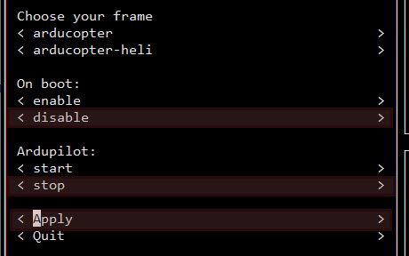

# Installation

Start with a fresh Raspberry image.
Confirmed working images:

:::warning Important

    Latest PI OS will not work with UAVcast-Pro 4.x versions. Please use the images below.
:::

- [Raspberry Pi 32bit OS Lite](https://downloads.raspberrypi.org/raspios_lite_armhf/images/raspios_lite_armhf-2021-05-28/2021-05-07-raspios-buster-armhf-lite.zip)
- [Raspberry Pi 32bit OS With Desktop](https://downloads.raspberrypi.org/raspios_armhf/images/raspios_armhf-2021-05-28/2021-05-07-raspios-buster-armhf.zip)

See the [https://www.raspberrypi.org/software/operating-systems/](https://www.raspberrypi.org/software/operating-systems/) for installation instruction. 
Continue to install UAVcast-Pro as described in the [installation](#uavcast-pro-installation) section

## UAVcast-Pro installation

You can install the latest version of UAVcast-Pro by pasting this command into you RPI shell.

```bash
curl -s https://install.uavmatrix.com | sudo bash
```

After the installation there will be validating proccess to verify that all component has been loaded successfully.
You can now access the webinterface using the RPI ip or Host name address in your browser. [http://raspberrypi/](http://raspberrypi/)

## Navio Flight Controller
For Navio+ and Navio2 boards, please use the installation procedure below:

- Install the latest image provided by [https://emlid.com](https://emlid.com).
- Connect to your RPI with SSH and run the **emlidtool** as described in the emlid documentation.[https://docs.emlid.com/navio2/common/ardupilot/installation-and-running/#choosing-a-vehicle-version-and-board](https://docs.emlid.com/navio2/common/ardupilot/installation-and-running/#choosing-a-vehicle-version-and-board)
- Select your vehicle, version and frame.
- **On Boot** Select disable
- **Ardupilot** Select stop
- **Apply** and exit.
- Install UAVcast-Pro as described [uavcast-pro-installation](#uavcast-pro-installation)

  