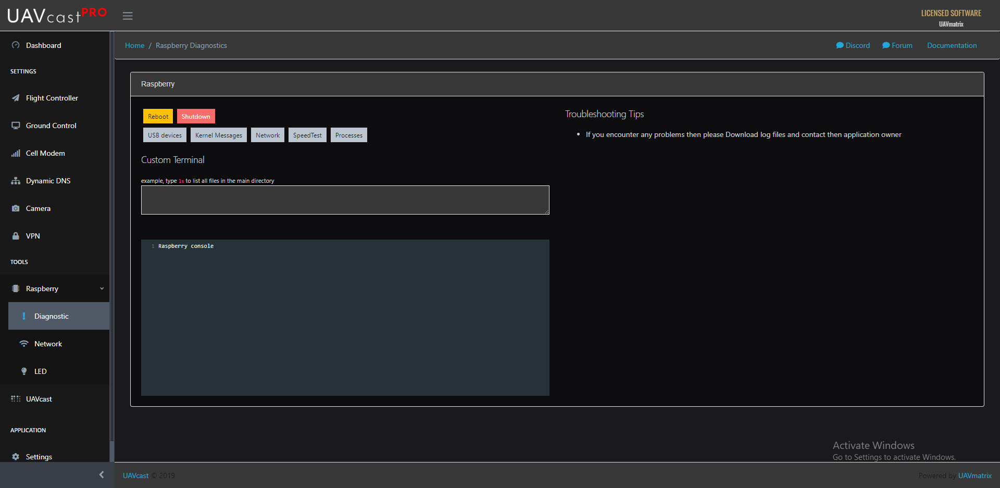
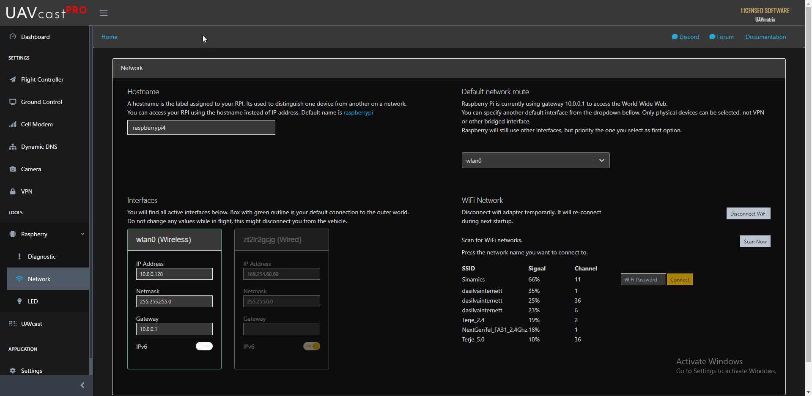
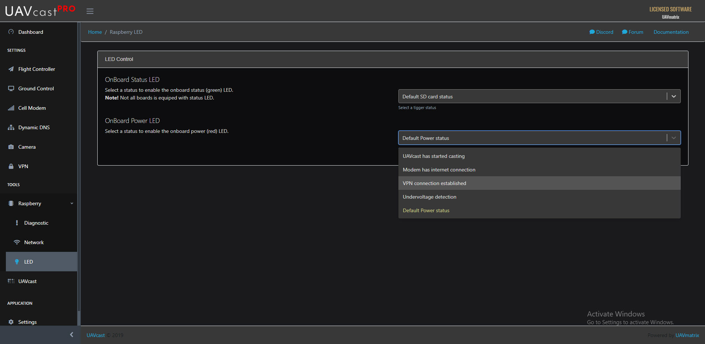

# Diagnostic

You have multiple options to diagnose your raspberry pi from this page. 

### Shutdown
This will shutdown the Raspberry Pi

### Reboot
Reboot your Raspberry Pi

### USB Devices   
Will list all connected USB devices.

### Kernel Messages
Will populate the kernel log

### Network
Will populate all network interfaces. (ifconfig)

### SpeedTest
Will test your upload and download broadband speed.

### Processes
Will list all active running processes

### Custom Terminal
You can interact with your Raspberry using the custom terminal window. You can type what ever you normally would from the shell window. 

# Network

Take full control over your raspberry pi network configuration. 

### Hostname
Set your prefered raspberry hostname. Default is `raspberrypi` 
You can access your raspberry using the hostname instead of ip address. 

Example, try open your browser and type `raspberrypi/` as the URL

### Network Route
Specify the default network route from the dropdown menu. Raspberry pi will try to use the selected device for accessing outer world. 
Only physical devices can be selected, not VPN or other bridged interface.
Raspberry will still be able to use other interfaces, but priority the one you select.

### WiFi network
You can search and connect wifi network from within UAVcast-Pro. 

### Interfaces
Will populate all interfaces and show the current configuration, such as IP, Netmask, Gateway and if you want to enable/disable IPv6.
Box with green outline is your default connection to the outer world.
Do not change any values while in flight, this might disconnect you from the vehicle.

# Led

:::warning
    This function is disabled on PiZero board.
:::

### OnBoard Status LED
You can customize the onboard Status LED to light up when a certain function within UAVcast has started. 

Such as:

-   UAVcast has started
-   Modem has established internet connection.
-   VPN connection established
-   Undervoltage Detected

### OnBoard Power LED
You can customize the onboard Power LED to light up when a certain function within UAVcast has started. 

-   UAVcast has started
-   Modem has established internet connection.
-   VPN connection established
-   Undervoltage Detected

