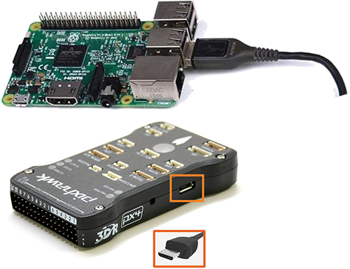
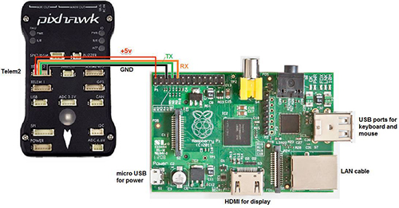
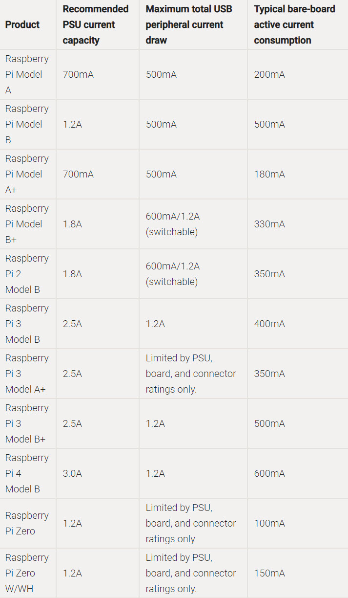
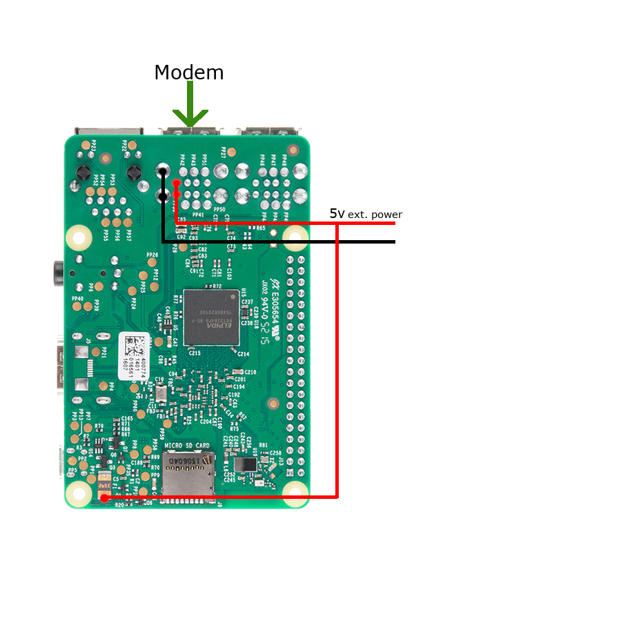

<!-- prettier-ignore -->
# Hardware Requirements

## Quick Overview
UAVcast-Pro v5 requires:
- 64-bit capable Raspberry Pi
- MAVLink flight controller
- Internet connection (Wi-Fi/Ethernet for testing, Modem for flight operations)

For manual flight control, we recommend using Mission Planner with USB gamepad integration.

## Flight Controllers

UAVcast-Pro supports all MAVLink-based flight controllers, including:
- Pixhawk series
- Cube
- Matek systems
- Other PX4 and Ardupilot compatible boards

Find supported Ardupilot controllers at: [Ardupilot Autopilot List](http://ardupilot.org/plane/docs/common-autopilots.html)

### Connection Methods

Connect your flight controller using either:

#### 1. USB Connection (Recommended)
- Simply connect FC to Raspberry Pi using USB
- Provides cleaner setup with less wiring

:::warning USB Cable Quality
Use high-quality USB cables with adequate thickness to ensure stable power delivery to the Flight Controller.
:::

#### 2. GPIO Connection
- Requires proper connection of TX, RX, and Ground
- More complex setup but equally performant

:::warning Power Requirements
Flight Controller telemetry ports cannot power the Raspberry Pi. See [Power Supply](#power-supply) section for proper power setup.
:::

## Supported Raspberry Pi Models

UAVcast-Pro v5 supports 64-bit capable Raspberry Pi models:
- Raspberry Pi Zero 2 W
- Raspberry Pi 3
- Raspberry Pi 4
- Raspberry Pi 5

:::tip Recommended
Raspberry Pi 4 with 4GB+ RAM is recommended for optimal performance, especially when running additional software alongside UAVcast-Pro.
:::

## Power Supply Requirements

Proper power delivery is critical for stable operation.

### Voltage Requirements
- Input voltage: 4.8V to 5.3V
- Must account for all connected devices (modem, camera, etc.)

### Power Considerations
1. Check your modem's power consumption against Raspberry Pi USB specifications
2. Include USB camera power requirements if used
3. Use proper power supply matching your setup's total power needs

Reference: [Raspberry Pi Power Specifications](https://www.raspberrypi.com/documentation/computers/raspberry-pi.html#typical-power-requirements)

### External Power Setup
For high-power setups (modem + camera), consider external power:

1. Connect power directly to USB +/- pins
2. Connect to RPI fuse for auto-boot capability

:::note
When using external power, connect high-power devices (modems) to the USB port with external power connection.
:::

## Modem

UAVcast uses modem manager and network manager to control the LTE connection.
Check out this page to find supported modems, [Supported modem](https://www.freedesktop.org/wiki/Software/ModemManager/SupportedDevices/)

### Recommended Huawei HiLink modems by Countries

:::note
    Please send a mail to **support@uavmatrix.com** or open a new PR on [github](https://github.com/UAVmatrix/uavcast-pro-docs) if you know of other working Huawei modems in your country!
:::

|    Country     |        Carrier         |            Recommended Modem            |                            Recommended APN                             |
| :------------: | :--------------------: | :-------------------------------------: | :--------------------------------------------------------------------: |
|   Australia    |        Telstra         |        E3372h-153 E3372h-607         |                    telstra.wap  telstra.internet                    |
|    Austria     | bob A1 Telekom Austria |        E3372h-153 E3372h-607         |                                 bob.at                                 |
|    Bulgaria    |        Vivacom         |        E3372h-153 E3372h-607         |                          internet.vivacom.bg                           |
| Czech Republic |           O2           |        E3372h-153 E3372h-607         |                                internet                                |
| Czech Republic |        Vodafone        |        E3372h-153 E3372h-607         |                                internet                                |
|     France     |        Bouygues        |        E3372h-153 E3372h-607         |                            mmsbouygtel.com                             |
|     France     |         Orange         |        E3372h-153 E3372h-607         |                           orange.fr / orange                           |
|     France     |          SFR           |        E3372h-153 E3372h-607         |                                 websfr                                 |
|    Germany     |        T-Mobile        |        E3372h-153 E3372h-607         |                            internet.t-d1.de                            |
|    Germany     |           O2           |        E3372h-153 E3372h-607         |                                internet                                |
|    Germany     |        Vodafone        |        E3372h-153 E3372h-607         |                            web.vodafone.de                             |
|     Greece     |        Cosmote         |        E3372h-153 E3372h-607         |                                internet                                |
|     Greece     |      WIND Hellas       |        E3372h-153 E3372h-607         |                            gint.b-online.gr                            |
|    Hungary     |     Magyar Telekom     |        E3372h-153 E3372h-607         |                            internet.telekom                            |
|     Italy      |         Iliad          |        E3372h-153 E3372h-607         |                                 iliad                                  |
|     Italy      |          TIM           |        E3372h-153 E3372h-607         |                              ibox.tim.it                               |
|     Italy      |        Vodafone        |        E3372h-153 E3372h-607         |                             web.omnitel.it                             |
|     Latvia     |         Tele2          |        E3372h-153 E3372h-607         |                        mobileinternet.tele2.lv                         |
|    Malaysia    |          DiGi          |        E3372h-153 E3372h-607         |                                diginet                                 |
|  Netherlands   |        T-Mobile        |        E3372h-153 E3372h-607         |                                internet                                |
|     Norway     |        Telenor         |        E3372h-153 E3372h-607         |                       internet.public / internet                       |
|     Poland     |         Orange         |        E3372h-153 E3372h-607         |                                internet                                |
|    Portugal    |        Vodafone        |        E3372h-153 E3372h-607         |                          internet.vodafone.pt                          |
|   Singapore    |        Singtel         |        E3372h-153 E3372h-607         |                                e-ideas                                 |
|   Singapore    |        StarHub         |        E3372h-153 E3372h-607         |                                 shwap                                  |
|     Spain      |        Movistar        |        E3372h-153 E3372h-607         |                              movistar.es                               |
|     Spain      |         Yoigo          |        E3372h-153 E3372h-607         |                                internet                                |
|     Sweden     |        Halebop         |        E3372h-153 E3372h-607         |                            halebop.telia.se                            |
|     Sweden     |         Tele2          |        E3372h-153 E3372h-607         |                              4G.tele2.se                               |
|     Sweden     |        Telenor         |        E3372h-153 E3372h-607         |                          internet.telenor.se                           |
|     Sweden     |         Telia          |        E3372h-153 E3372h-607         |                            online.telia.se                             |
|  Switzerland   |          Salt          |        E3372h-153 E3372h-607         |                                internet                                |
|  Switzerland   |        Sunrise         |        E3372h-153 E3372h-607         |                                internet                                |
|  Switzerland   |        Swisscom        |        E3372h-153 E3372h-607         |                            gprs.swisscom.ch                            |
|  Switzerland   |        Swisscom        |        E3372h-153 E3372h-607         | corporate.swisscom.ch APN User: testprofil and APN Password: temporary |
|     Turkey     |        Turkcell        |        E3372h-153 E3372h-607         |                             mgb / internet                             |
|       UK       |           EE           |        E3372h-153 E3372h-607         |                               everywhere                               |
|      USA       |          AT&T          |               E3372h-510                |                                various                                 |
|      USA       |         Sprint         |                 No info                 |                                No Info                                 |
|      USA       |        T-Mobile        | E3372h-510 E3276s-505 MS2372h-517 |                   fast.t-mobile.com, epc.tmobile.com                   |
|      USA       |        Verizon         |               E3372h-510                |                              vzwinternet                               |

:::success Modem LED Status
    - Green, flashing twice every 2s: The USB-Modem is powered on.
    - Green, flashing once every 0.2s: The software of the USB-Modem is being upgraded.
    - Green, flashing once every 2s: The USB-Modem is registering with a 2G network.
    - Blue, flashing once every 2s: The USB-Modem is registering with a 3G network.
    - Cyan, flashing once every 2s: The USB-Modem is registering with a 4G network.
    - Green, solid: The USB-Modem is connected to a 2G network.
    - Blue, solid: The USB-Modem is connected to a 3G network.
    - Cyan, solid: The USB-Modem is connected to a 4G network.
:::

## HiLink vs. Stick Modems

### HiLink Modems
HiLink is plug-and-play modem technology, offering driverless installation across operating systems.

**Identification:**
- Look for "HiLink" logo on the modem
- Model number includes "H" (e.g., E3372H)
- Listed in our [compatibility table](#compatibility-table)

#### Advantages
✓ Instant plug-and-play operation  
✓ Fast connection establishment  
✓ Web-based interface for settings  
✓ Simple integration with Raspberry Pi  

### Stick Modems
Traditional USB modems requiring AT commands for cellular connection setup.

#### Key Features
- Full configuration control
- Native port forwarding support
- Requires initial setup in UAVcast-Pro
- Integrated AT command support in UAVcast-Pro

:::note Configuration
UAVcast-Pro includes all necessary tools and commands for stick modem setup - no manual AT command knowledge required.
:::

## Camera

There are several cameras that works with UAVcast-Pro,

- PiCam
- Logitech C920
- Logitech C615
- Many Other USB cameras will probably work.
- GoPro. ([Can be used with HDMI to CSI converter](https://www.ebay.com/itm/1-Port-For-Raspberry-Pi-HDMI-To-CSI-2-Bridge-Adapter-Module-UP-To-1080p-25fps-/233297430162)). This allows users to record and view live stream simultaneously.

<!-- PiCam is a perfect camera for this type application and provides 1080p video.
If you want to use another camera not listed, then make sure it has Hardware Encoder integrated to get the best quality. -->

[Mission Planner](http://ardupilot.org/planner/docs/mission-planner-installation.html) and [QGroundControl](http://qgroundcontrol.com/) supports video stream by default on port 5600.
